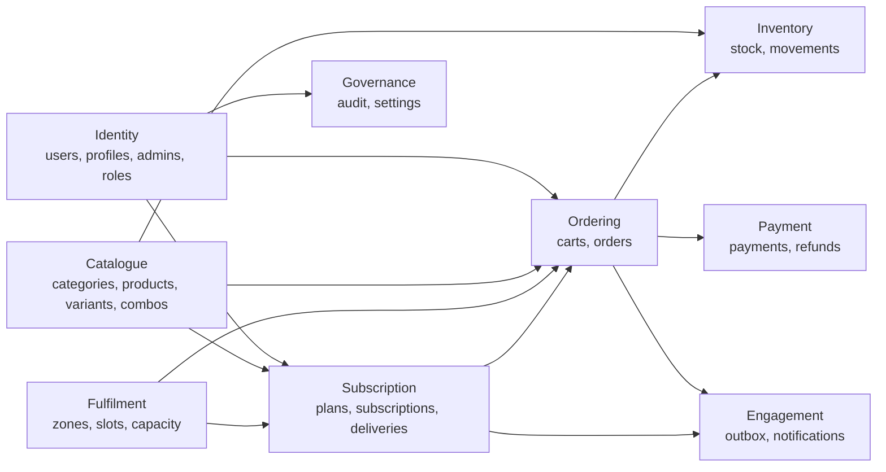
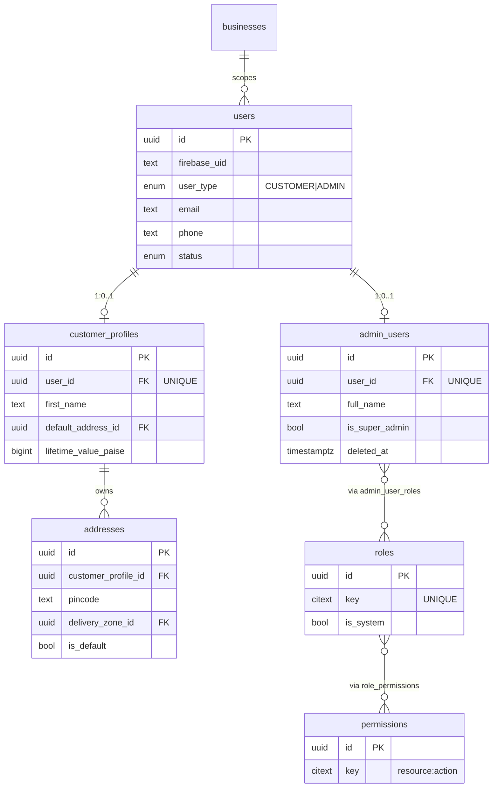
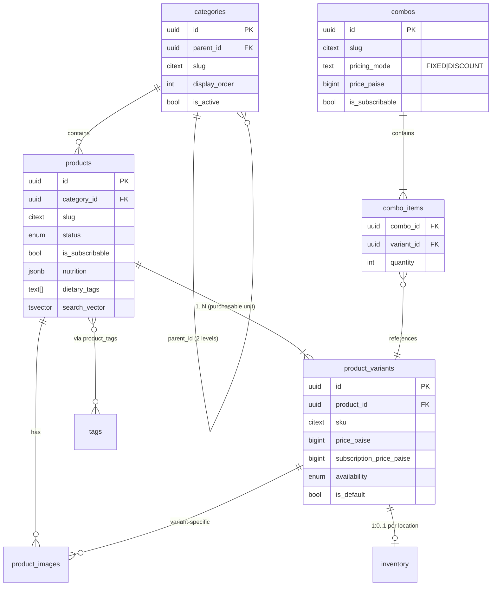
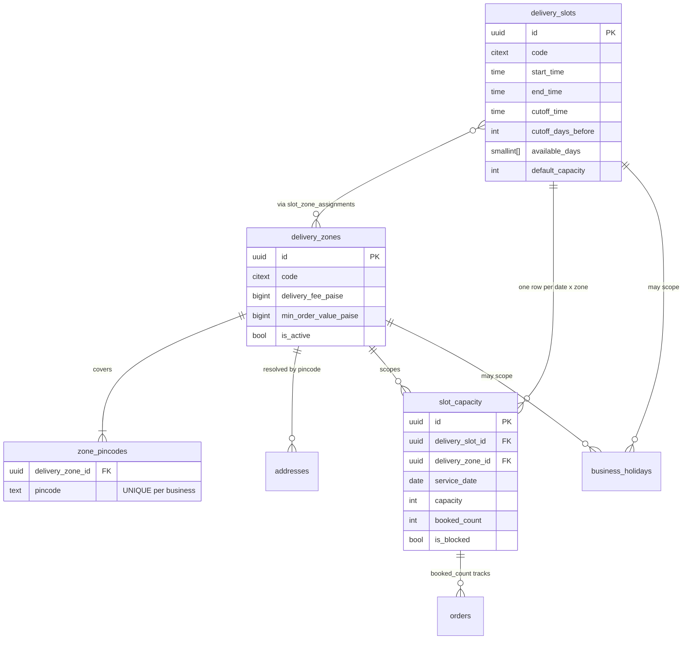
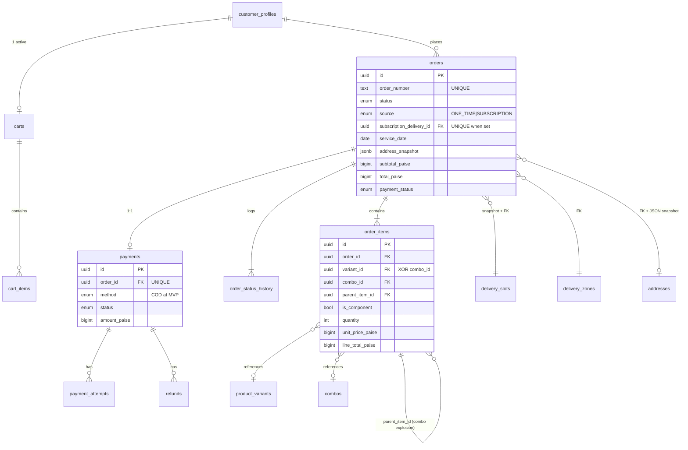
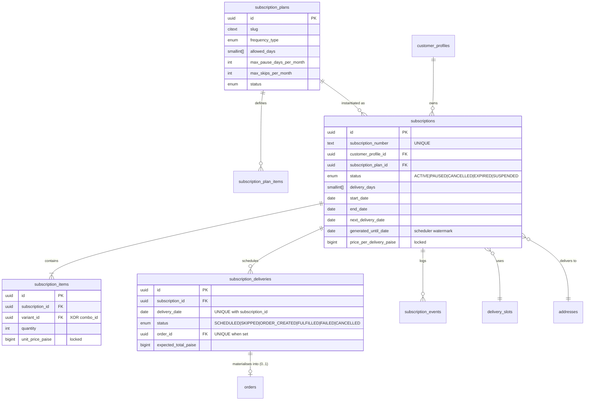
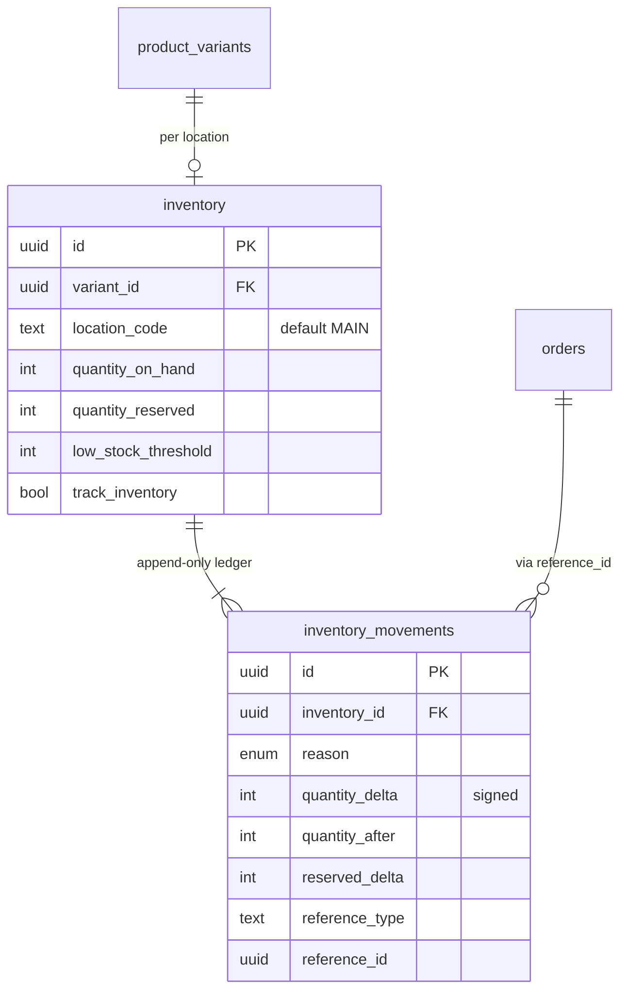
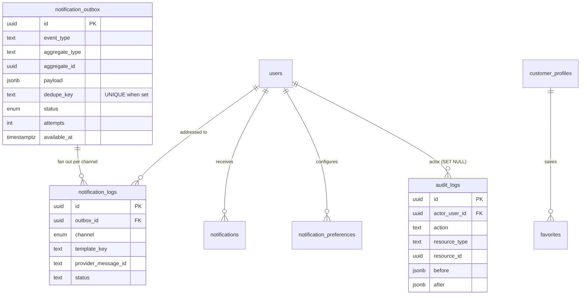

# 05 — Database ERD

Diagrams are Mermaid and render in GitHub. They show relationships and cardinality;
[04-DATABASE-DESIGN.md](04-DATABASE-DESIGN.md) remains authoritative for columns and
constraints. Only key columns are shown, for legibility.

## 1. Context map



Read the arrows as "depends on / writes into". Note that **Subscription points at Ordering,
never the reverse**: a subscription creates orders, and an order merely remembers which
delivery produced it. That direction is what keeps the order state machine independent of
subscription concerns.

## 2. Identity and access



**Key point:** `users` is the single identity table for both audiences, discriminated by
`user_type` and uniquely keyed by `(firebase_uid, user_type)`. Profile data is split into
`customer_profiles` and `admin_users` so the two never share columns and an accidental
`SELECT *` on a customer cannot leak staff fields.

## 3. Catalogue



**Key point:** the purchasable unit is always `product_variants`. `products` carries
marketing and nutrition information; it has no price. Combos reference variants, never
products, so every purchase path resolves to the same leaf entity.

## 4. Fulfilment — zones, slots, capacity



**Key point:** `slot_capacity` is the only table that is locked during checkout. Its unique
key `(delivery_slot_id, delivery_zone_id, service_date)` plus
`CHECK (booked_count <= capacity)` make over-booking a database error rather than an
operational disaster.

## 5. Ordering



### 5.1 How a combo is stored in an order

```
orders
└── order_items
    ├── [parent]    combo_id = Morning Wellness Combo
    │                is_component = false
    │                quantity = 1
    │                unit_price_paise = 24900     ← the money lives here
    │                line_total_paise = 24900
    ├── [component] variant_id = Mixed Fruit Bowl 250g
    │                is_component = true, parent_item_id = parent
    │                quantity = 1, unit_price_paise = 0   ← logistics only
    ├── [component] variant_id = Moong Sprouts 150g
    │                is_component = true, parent_item_id = parent
    └── [component] variant_id = Orange Juice 200ml
                     is_component = true, parent_item_id = parent
```
`subtotal_paise` sums only rows where `is_component = false`.
Inventory reservation and the kitchen prep list read only rows where `is_component = true`
(plus non-combo lines). Neither view double-counts.

## 6. Subscription



### 6.1 The two constraints that prevent duplicate deliveries

```
UNIQUE (subscription_id, delivery_date)         on subscription_deliveries
UNIQUE (subscription_delivery_id) WHERE NOT NULL on orders
```

The first stops the **generator** from scheduling a date twice. The second stops the
**materialiser** from turning one delivery into two orders. Together they make the guarantee
structural rather than procedural — it holds under concurrent workers, retries, replays and
redeploys, without any distributed lock. This is the single most important pair of
constraints in the schema (BR-S9).

### 6.2 Subscription to order flow

```mermaid
sequenceDiagram
  autonumber
  participant Cron as worker (01:00 IST)
  participant Gen as generateDeliveries
  participant DB as PostgreSQL
  participant Mat as materialiseOrders (hourly)
  participant Out as outbox

  Cron->>Gen: for each ACTIVE subscription
  Gen->>DB: read generated_until_date
  Gen->>Gen: expand recurrence to horizon<br/>minus holidays, pause window, end_date
  Gen->>DB: INSERT subscription_deliveries<br/>ON CONFLICT (subscription_id, delivery_date) DO NOTHING
  Gen->>DB: UPDATE generated_until_date, next_delivery_date

  Note over Mat: separately, hourly
  Mat->>DB: SELECT deliveries WHERE status='SCHEDULED'<br/>AND delivery_date <= today + materialise_horizon
  Mat->>DB: BEGIN; lock delivery row FOR UPDATE
  Mat->>DB: lock slot_capacity FOR UPDATE, check + increment
  Mat->>DB: reserve inventory
  Mat->>DB: INSERT order (subscription_delivery_id = delivery.id)
  Mat->>DB: UPDATE delivery SET status='ORDER_CREATED', order_id
  Mat->>Out: INSERT outbox SUBSCRIPTION_ORDER_CREATED
  Mat->>DB: COMMIT
```

If any step fails, the whole transaction rolls back, the delivery stays `SCHEDULED`, and the
next hourly run retries it. If it keeps failing past the cutoff, it is marked `FAILED` with a
`failure_reason`, the customer is notified, and it appears on the ops exception list
(EC-S2, EC-S3).

## 7. Inventory



`quantity_available = quantity_on_hand - quantity_reserved` is always computed, never
stored. Every mutation of `inventory` writes a matching `inventory_movements` row in the
same transaction, so the ledger can always be replayed to verify the balance.

## 8. Engagement and governance



## 9. Full relationship reference

| Parent | Child | Card. | On delete | Note |
|---|---|---|---|---|
| businesses | everything operational | 1:N | RESTRICT | Multi-business seam |
| users | customer_profiles | 1:0..1 | RESTRICT | |
| users | admin_users | 1:0..1 | RESTRICT | |
| customer_profiles | addresses | 1:N | RESTRICT | Soft delete instead |
| customer_profiles | carts | 1:0..1 | CASCADE | |
| customer_profiles | orders | 1:N | RESTRICT | |
| customer_profiles | subscriptions | 1:N | RESTRICT | |
| customer_profiles | favorites | 1:N | CASCADE | |
| categories | categories | 1:N | RESTRICT | Max depth 2 |
| categories | products | 1:N | RESTRICT | |
| products | product_variants | 1:N (≥1) | RESTRICT | |
| products | product_images | 1:N | CASCADE | |
| product_variants | inventory | 1:0..1 per location | CASCADE | |
| product_variants | cart_items | 1:N | CASCADE | |
| product_variants | order_items | 1:N | RESTRICT | History |
| product_variants | combo_items | 1:N | RESTRICT | |
| combos | combo_items | 1:N (≥1) | CASCADE | |
| delivery_zones | zone_pincodes | 1:N | CASCADE | |
| delivery_zones | slot_capacity | 1:N | CASCADE | |
| delivery_slots | slot_capacity | 1:N | CASCADE | |
| delivery_slots | orders | 1:N | RESTRICT | Snapshot also stored |
| carts | cart_items | 1:N | CASCADE | |
| orders | order_items | 1:N | CASCADE | |
| orders | order_status_history | 1:N | CASCADE | |
| orders | payments | 1:0..1 | RESTRICT | |
| payments | payment_attempts | 1:N | CASCADE | |
| payments | refunds | 1:N | RESTRICT | |
| subscription_plans | subscriptions | 1:N | RESTRICT | |
| subscriptions | subscription_items | 1:N | CASCADE | |
| subscriptions | subscription_deliveries | 1:N | RESTRICT | |
| subscriptions | subscription_events | 1:N | CASCADE | |
| subscription_deliveries | orders | 1:0..1 | SET NULL | Partial unique |
| inventory | inventory_movements | 1:N | RESTRICT | |
| notification_outbox | notification_logs | 1:N | CASCADE | |
| roles | role_permissions | 1:N | CASCADE | |
| admin_users | admin_user_roles | 1:N | CASCADE | |

## 10. Entities that are easy to confuse

| These are different | Because |
|---|---|
| **User** vs **Customer** | `users` is an identity (a Firebase login). `customer_profiles` is a commercial relationship. An admin has a user but no customer profile. |
| **Product** vs **Variant** | A product is what you read about. A variant is what you buy. Prices, SKUs, stock and orders attach to the variant only. |
| **Combo** vs **Product** | A combo is a sellable bundle of variants with its own price. It is never a category of product and never has its own inventory row. |
| **Order** vs **Subscription** | An order is one delivery's commercial transaction. A subscription is a standing instruction that produces many orders over time. |
| **Subscription** vs **Subscription Delivery** | The subscription is the contract. A delivery is one dated occurrence of it, which may be skipped and may never become an order. |
| **Subscription Delivery** vs **Order** | A delivery is the *plan*; the order is the *execution*. `SKIPPED` deliveries never produce an order — which is exactly why the two are separate tables. |
| **Slot** vs **Slot Capacity** | A slot is a recurring rule ("Morning 06:00–08:00, Mon–Fri"). Capacity is the bookable inventory of that rule on one concrete date in one zone. |
| **Availability** vs **Stock** | Availability is editorial ("we are not selling this today"). Stock is quantitative. Both must pass for a line to be purchasable. |
| **Audit log** vs **application log** | Audit logs are durable business facts in Postgres. Application logs are ephemeral technical telemetry. |
