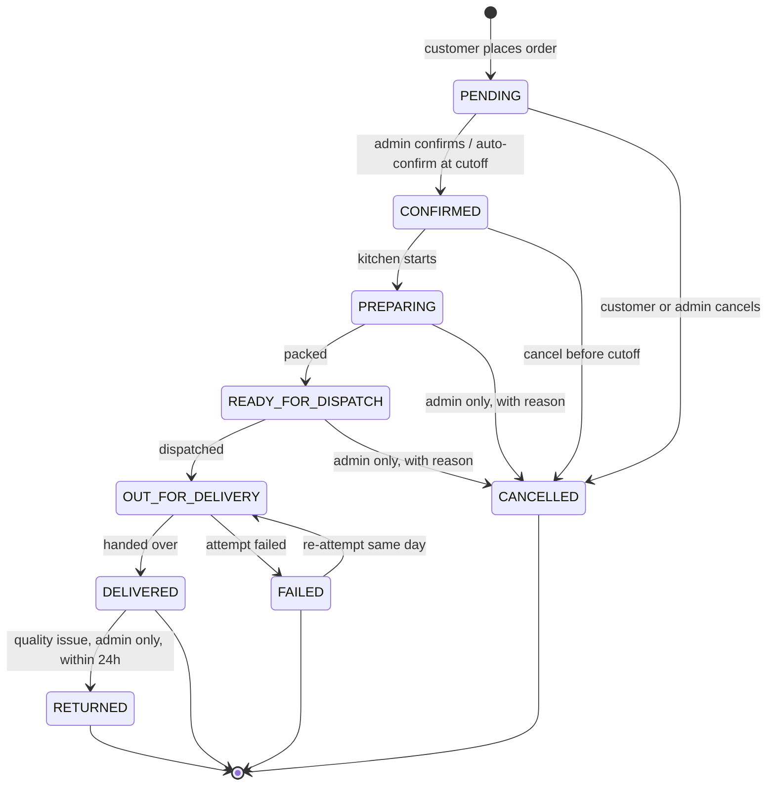

# 09 — Order Lifecycle

## 1. States

| State | Meaning | Customer sees | Terminal |
|---|---|---|---|
| `PENDING` | Placed, awaiting business confirmation | "Order placed" | No |
| `CONFIRMED` | Accepted; will be prepared | "Confirmed" | No |
| `PREPARING` | Being made in the kitchen | "Being prepared" | No |
| `READY_FOR_DISPATCH` | Packed, waiting for the delivery run | "Packed & ready" | No |
| `OUT_FOR_DELIVERY` | With the delivery person | "On the way" | No |
| `DELIVERED` | Handed over | "Delivered" | **Yes** |
| `CANCELLED` | Cancelled before dispatch | "Cancelled" | **Yes** |
| `FAILED` | Attempted but not delivered (customer unreachable, address wrong) | "Delivery failed" | **Yes** |
| `RETURNED` | Delivered then returned (quality complaint) | "Returned" | **Yes** |

`CART` and `CHECKOUT` from the brief are **not order states**. A cart is a different entity
with its own table; checkout is a client-side flow. An order row exists only once the
customer has committed. Modelling cart as an order state would mean every abandoned basket
pollutes the orders table, corrupts every order metric, and consumes order numbers.

`REFUNDED` and `PARTIALLY_REFUNDED` are **payment** states, not order states, and live on
`payments.status`. An order can be `DELIVERED` and `REFUNDED` at the same time — one fact
about fulfilment, one about money. Collapsing them into a single enum makes both
unrepresentable (BR-O1).

## 2. State machine



## 3. Transition table

Who may trigger what, and under which conditions. This table is implemented literally as a
data structure in `packages/core/src/domain/order-state-machine.ts`; the API, the bulk
endpoint, the worker and any future ops app all consult the same table.

| From | To | Customer | Admin permission | Conditions | Side effects |
|---|---|:--:|---|---|---|
| — | `PENDING` | ✅ | — | Cart valid, slot open, stock reserved | Capacity +1, stock reserved, payment `DUE`, `ORDER_PLACED` |
| `PENDING` | `CONFIRMED` | ❌ | `orders:update_status` | — | `ORDER_CONFIRMED` |
| `PENDING` | `CONFIRMED` | — (SYSTEM) | — | Auto at cutoff (BR-O3) | `ORDER_CONFIRMED` |
| `PENDING` | `CANCELLED` | ✅ | `orders:cancel` | `now() < cutoff_at` for the customer; admin any time | Capacity −1, reservation released, payment `CANCELLED`, `ORDER_CANCELLED` |
| `CONFIRMED` | `PREPARING` | ❌ | `orders:update_status` | — | Reservation → consumption, `ORDER_PREPARING` |
| `CONFIRMED` | `CANCELLED` | ✅ | `orders:cancel` | Customer only before cutoff | As above |
| `PREPARING` | `READY_FOR_DISPATCH` | ❌ | `orders:update_status` | — | `ORDER_READY` |
| `PREPARING` | `CANCELLED` | ❌ | `orders:cancel` | Reason required | Capacity −1, stock **written off as wastage** |
| `READY_FOR_DISPATCH` | `OUT_FOR_DELIVERY` | ❌ | `orders:update_status` | — | `ORDER_OUT_FOR_DELIVERY` |
| `READY_FOR_DISPATCH` | `CANCELLED` | ❌ | `orders:cancel` | Reason required | Capacity −1, wastage |
| `OUT_FOR_DELIVERY` | `DELIVERED` | ❌ | `orders:update_status` | — | COD payment `PAID`, counters updated, `ORDER_DELIVERED` |
| `OUT_FOR_DELIVERY` | `FAILED` | ❌ | `orders:update_status` | Reason required | Payment `CANCELLED`, wastage, `ORDER_FAILED` |
| `FAILED` | `OUT_FOR_DELIVERY` | ❌ | `orders:update_status` | Same `service_date` only | Re-attempt |
| `DELIVERED` | `RETURNED` | ❌ | `orders:cancel` | Within 24h, reason required | Refund initiated (P2), `ORDER_RETURNED` |

**Any transition not in this table is rejected** with `409 INVALID_STATUS_TRANSITION`,
returning the current status and the allowed next states. There is no "force status" escape
hatch: an ops person who needs an impossible transition has hit either a bug or a genuinely
new business rule, and both deserve a conversation rather than a corrupted record.

### 3.1 Skipping states
Admins may skip forward (`CONFIRMED → READY_FOR_DISPATCH`) when the kitchen batches work,
**provided the path exists in the graph** — the machine walks intermediate states internally
and writes a history row for each, so timestamps and reporting stay intact. Backward
transitions are never allowed; a mistake is corrected by cancelling and re-creating, which
leaves an honest audit trail.

## 4. Order placement in detail

```mermaid
sequenceDiagram
  autonumber
  participant C as Customer
  participant API
  participant DB as PostgreSQL
  participant OB as Outbox

  C->>API: POST /v1/me/orders (Idempotency-Key, expected_total_paise)
  API->>DB: idempotency lookup
  alt key COMPLETED
    API-->>C: 200 replayed response
  end
  API->>DB: BEGIN
  API->>DB: INSERT idempotency_keys (IN_PROGRESS)  -- unique index is the mutex
  API->>DB: SELECT cart + items FOR UPDATE
  API->>API: re-price every line from live catalogue
  API->>API: compare with expected_total_paise
  Note over API: mismatch → rollback, 409 PRICE_CHANGED
  API->>DB: resolve zone from address; check min order value
  API->>DB: SELECT slot_capacity FOR UPDATE   ← serialisation point
  Note over API: booked_count >= capacity → 409 SLOT_CAPACITY_EXCEEDED
  API->>API: check cutoff_at > now()
  API->>DB: SELECT inventory FOR UPDATE (ordered by variant_id)
  Note over API: insufficient → 409 INSUFFICIENT_STOCK
  API->>DB: UPDATE slot_capacity SET booked_count = booked_count + 1
  API->>DB: UPDATE inventory SET quantity_reserved += n  (+ movements)
  API->>DB: INSERT orders (order_number from sequence)
  API->>DB: INSERT order_items (parents + combo components)
  API->>DB: INSERT order_status_history (NULL → PENDING)
  API->>DB: INSERT payments (COD, DUE)
  API->>OB: INSERT notification_outbox ORDER_PLACED
  API->>DB: DELETE cart_items
  API->>DB: UPDATE idempotency_keys (COMPLETED, response)
  API->>DB: COMMIT
  API-->>C: 201 Order
```

**Lock ordering is fixed and global:** `slot_capacity` → `inventory` (ascending `variant_id`)
→ `orders`. Every writer in the system — checkout, subscription materialisation, admin
cancellation — takes locks in this order, which is what makes deadlocks structurally
impossible rather than rare.

**Why `expected_total_paise`:** admins edit prices during the day. Without the assertion, a
customer who opened checkout at ₹327 could be charged ₹349 because an admin published a price
change in between. With it, the order fails loudly and the customer re-confirms (BR-K6).

## 5. Business rules

| ID | Rule |
|---|---|
| BR-O1 | Order status describes **fulfilment**. Payment status describes **money**. They are independent fields and independent state machines. |
| BR-O2 | An order cannot be placed for a slot whose `cutoff_at` has passed. |
| BR-O3 | `PENDING` orders auto-`CONFIRMED` by the `auto-confirm-orders` job when the slot cutoff passes, so the kitchen never waits on a manual click. |
| BR-O4 | A customer may cancel only while `PENDING` or `CONFIRMED` **and** before `cutoff_at`. |
| BR-O5 | After `PREPARING`, only an admin may cancel, and a reason is mandatory. |
| BR-O6 | Cancellation before `PREPARING` **releases** the inventory reservation. Cancellation at or after `PREPARING` **writes it off as wastage** — the food was made. |
| BR-O7 | Cancellation always decrements `slot_capacity.booked_count`, freeing the slot for someone else. |
| BR-O8 | Order totals are immutable after placement. A correction is a refund or a credit, never an edit. |
| BR-O9 | `order_number` comes from a Postgres sequence, is never reused, and never reflects volume-hiding gaps as an error. |
| BR-O10 | Every transition writes an `order_status_history` row with actor and timestamp, in the same transaction. |
| BR-O11 | COD payment moves to `PAID` only on `DELIVERED`, recording which staff member collected. |
| BR-O12 | `FAILED` orders may be re-attempted on the same `service_date` only. A different date requires a new order. |
| BR-O13 | An order's `service_date` and slot may be changed by an admin only while `PENDING` or `CONFIRMED`, and the change moves capacity between the two `slot_capacity` rows atomically. |
| BR-O14 | Subscription orders follow **exactly this** state machine. `source='SUBSCRIPTION'` changes who created the order, not how it behaves. |

## 6. Subscription orders in the same lifecycle

A subscription order is an ordinary order with two extra columns populated:

```
orders.source                   = 'SUBSCRIPTION'
orders.subscription_id          = <subscription>
orders.subscription_delivery_id = <delivery>   UNIQUE where not null
orders.channel                  = 'SYSTEM'
```

Consequences:
- The ops dashboard, prep list and dispatch manifest need no special case — they query
  `orders` by `service_date` and slot, and subscription orders simply appear.
- The state machine is shared, so a subscription order cannot enter a state a normal order
  cannot.
- Cancelling a subscription order cancels **that delivery**, not the subscription. The
  linked `subscription_deliveries` row moves to `CANCELLED` and the subscription keeps
  running. This distinction is explicit in the UI copy, because conflating them is the
  single most common subscription-product complaint.
- Deleting a subscription never deletes its orders; `subscription_id` is `ON DELETE SET NULL`
  and subscriptions are not hard-deleted anyway.

## 7. Timestamps and SLA

Milestone columns (`confirmed_at`, `prepared_at`, `dispatched_at`, `delivered_at`) are set on
transition. They are denormalised from `order_status_history` because the operations
dashboard queries them constantly and a per-order history scan would be the slowest query in
the system.

Derived metrics:
- **Slot adherence** — `delivered_at` within `[slot_start, slot_end]` on `service_date`.
- **Prep lead time** — `dispatched_at − prepared_at`.
- **Confirmation lag** — `confirmed_at − placed_at`.

## 8. Concurrency scenarios

| Scenario | Outcome |
|---|---|
| Two customers take the last slot simultaneously | `FOR UPDATE` serialises them; the second gets `409 SLOT_CAPACITY_EXCEEDED` |
| Customer double-taps "Place order" | Same `Idempotency-Key`; the second request replays the first response, or gets `409 IDEMPOTENT_REQUEST_IN_PROGRESS` if still running |
| Two admins change status at once | Both read `CONFIRMED`; the second's transition is re-validated inside the transaction against the row-locked current status and rejected if it no longer applies |
| Admin cancels while the customer is cancelling | Row lock on the order; the second sees `CANCELLED` and returns `409 ORDER_NOT_CANCELLABLE` |
| Scheduler runs twice | Partial unique on `subscription_delivery_id` rejects the duplicate order insert |
| Stock changes mid-checkout | Inventory rows are locked and re-read inside the transaction; the pre-check outside it is advisory only |

## 9. Failure and recovery

| Failure | Behaviour |
|---|---|
| DB error mid-transaction | Full rollback. No capacity consumed, no stock reserved, no order. Idempotency key remains `IN_PROGRESS` and expires. |
| API crashes after commit, before responding | Client retries with the same key → `200` replay of the committed order. |
| Outbox dispatch fails | Order is unaffected. The outbox retries with backoff; after 5 attempts it is `DEAD` and alerts. A missing email never breaks an order. |
| Order stuck `OUT_FOR_DELIVERY` past its slot | `close-stale-orders` flags it on the ops exception list at 23:30; it never auto-transitions, because only a human knows what happened. |
| COD not collected | `payments.status` stays `DUE` on a `DELIVERED` order and appears on the reconciliation report. |
