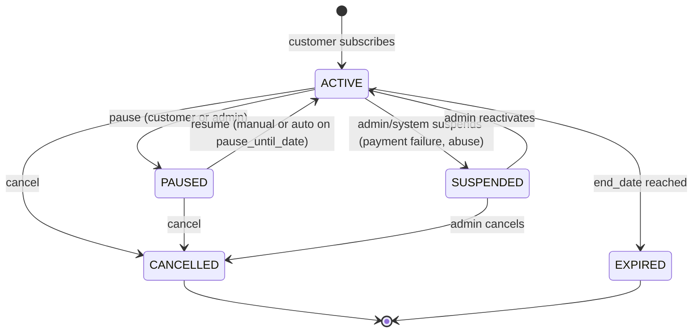
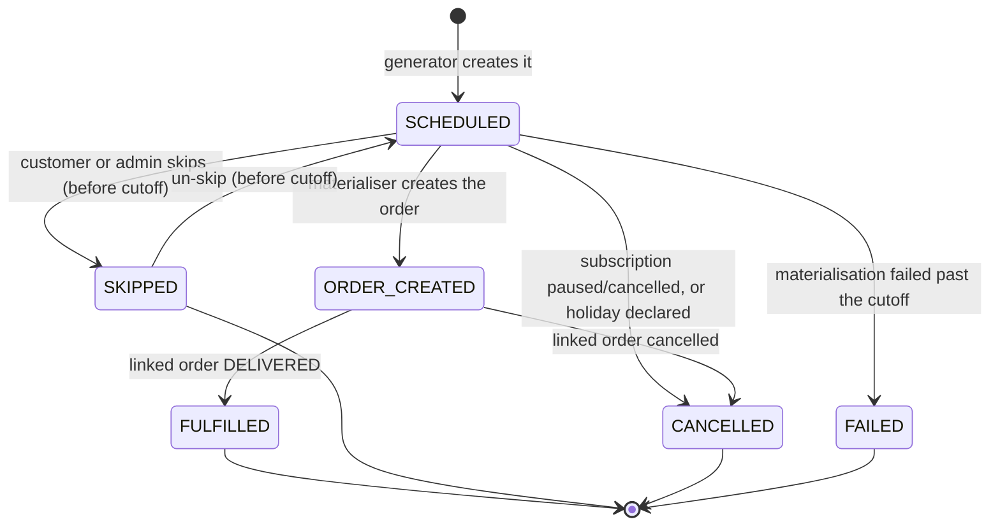

# 11 — Subscription Engine

The subscription engine is the most important and most failure-prone part of this system.
A bug here delivers food nobody ordered, charges for food nobody received, or silently stops
delivering to a paying customer. This document specifies it precisely.

## 1. The four entities, and why there are four

| Entity | Answers | Lifetime |
|---|---|---|
| `subscription_plans` | "What is on offer?" | Months — an admin artefact |
| `subscriptions` | "What did this customer commit to?" | Months — the contract |
| `subscription_items` | "What is in each delivery?" | Same as the subscription |
| `subscription_deliveries` | "What happens on 22 Sep?" | One day — a dated occurrence |

The critical separation is the last one. A naive design puts `is_subscription = true` on
orders and computes the next delivery on the fly. That design cannot answer "show me my next
two weeks", cannot represent a skipped occurrence (an order that must never exist), has no
natural place for "this delivery failed because the slot was full", and has no idempotency
key — so a retry creates a duplicate.

`subscription_deliveries` fixes all four: it is a **materialised plan** that exists before
any order does, carries its own status, and is uniquely keyed by
`(subscription_id, delivery_date)`.

```
plan (offer)
  └── subscription (contract)
        ├── subscription_items (contents)
        └── subscription_deliveries (one row per date)  ──0..1──> order
                 SCHEDULED / SKIPPED / ORDER_CREATED / FULFILLED / FAILED / CANCELLED
```

## 2. Subscription state machine



| State | Generates deliveries | Customer can |
|---|---|---|
| `ACTIVE` | Yes | Pause, skip, cancel, edit |
| `PAUSED` | No | Resume, cancel |
| `SUSPENDED` | No | Nothing — contact support |
| `EXPIRED` | No | Resubscribe (creates a new subscription) |
| `CANCELLED` | No | Resubscribe |

`CANCELLED` and `EXPIRED` are terminal. Re-activating a cancelled subscription is
deliberately not supported: the price, the plan and the catalogue may all have changed, and
resubscribing produces a clean, correctly-priced contract rather than a resurrected one with
stale snapshots.

## 3. Delivery state machine



## 4. The two jobs

The engine is deliberately split into **generation** (planning) and **materialisation**
(execution). They run at different cadences, for different reasons, and a failure in one
does not corrupt the other.

### 4.1 Generator — `generate-subscription-deliveries`, 01:00 IST daily

**Purpose:** ensure every `ACTIVE` subscription has `SCHEDULED` deliveries out to the
generation horizon (default 14 days).

```
for each ACTIVE subscription (batched, advisory-locked per subscription):
  from = max(generated_until_date + 1, start_date, today)
  to   = today + subscription.generation_horizon_days
  clamp to end_date if set

  dates = expandRecurrence(frequency_type, delivery_days, interval_days, from, to)
  dates = dates
        − business_holidays (zone/slot aware)
        − dates where the slot is not available on that weekday
        − dates inside an active pause window

  for each date:
    INSERT INTO subscription_deliveries (...)
    ON CONFLICT (subscription_id, delivery_date) DO NOTHING   ← idempotency

  UPDATE subscriptions
     SET generated_until_date = to,
         next_delivery_date   = earliest SCHEDULED delivery
```

**Why `generated_until_date` is a watermark, not a counter:** generation is expressed as
"extend coverage from X to Y", so re-running it produces nothing new. Combined with
`ON CONFLICT DO NOTHING` on the unique key, the job is idempotent under retries, concurrent
execution, and redeploys mid-run.

**Recurrence expansion** is a pure function in `packages/core/src/domain/recurrence.ts` with
no I/O, so every calendar edge case is covered by fast unit tests:

| `frequency_type` | Expansion |
|---|---|
| `DAILY` | Every day in range |
| `WEEKLY` | ISO weekdays in `delivery_days` |
| `CUSTOM_DAYS` | Same as weekly; the label differs in the UI |
| `ALTERNATE_DAYS` | Every `interval_days` from `start_date`, anchored to `start_date` so a pause does not shift the rhythm |
| `MONTHLY` | Same day-of-month; a 31st in a 30-day month clamps to the last day (EC-S9) |

### 4.2 Materialiser — `materialise-subscription-orders`, hourly

**Purpose:** turn imminent `SCHEDULED` deliveries into real orders.

```
for each delivery WHERE status='SCHEDULED'
      AND delivery_date <= today + materialise_horizon (default 36h)
      AND subscription.status = 'ACTIVE':

  BEGIN
    SELECT delivery FOR UPDATE
    re-check status = 'SCHEDULED'                  -- someone may have skipped it
    re-check subscription still ACTIVE             -- someone may have paused

    validate items still purchasable               -- EC-S4
    SELECT slot_capacity FOR UPDATE; check + increment   -- EC-S2
    reserve inventory                              -- EC-S3

    INSERT orders (source='SUBSCRIPTION', channel='SYSTEM',
                   subscription_id, subscription_delivery_id = delivery.id,
                   price snapshots from subscription_items)
    INSERT order_items, order_status_history (NULL → PENDING), payments (COD, DUE)
    UPDATE delivery SET status='ORDER_CREATED', order_id, materialised_at
    INSERT outbox SUBSCRIPTION_ORDER_CREATED
  COMMIT
```

**On failure:** the transaction rolls back, the delivery stays `SCHEDULED`, and the next
hourly run retries. Once `now() > cutoff_at(delivery_date)` the delivery is marked `FAILED`
with a `failure_reason`, the customer is notified, and it appears on the admin exception
list. A silent failure is worse than a loud one: the customer expected food.

**Why 36 hours:** long enough that a failure has several retry attempts before the cutoff,
short enough that subscription orders consume slot capacity at roughly the same time as
one-time orders rather than pre-empting the whole week (BR-S8).

### 4.3 Reminder — `send-delivery-reminders`, 20:00 IST daily
Finds tomorrow's `SCHEDULED` and `ORDER_CREATED` deliveries with `reminder_sent_at IS NULL`,
emits one outbox event each, and stamps `reminder_sent_at` in the same transaction. The
stamp plus the outbox `dedupe_key` make double-reminders impossible.

## 5. Duplicate prevention — the guarantee

Three independent mechanisms, each sufficient on its own:

| # | Mechanism | Stops |
|---|---|---|
| 1 | `UNIQUE (subscription_id, delivery_date)` | Two deliveries for one date |
| 2 | `UNIQUE (subscription_delivery_id) WHERE NOT NULL` on `orders` | Two orders from one delivery |
| 3 | Row lock + status re-check inside the transaction | Concurrent materialisation of the same row |

Mechanisms 1 and 2 are **database constraints**, so they hold regardless of application
logic, worker count, retry behaviour or deployment topology. No distributed lock, no leader
election, no queue deduplication is required. This is the design's central claim and it is
tested explicitly (doc 24 §5): the test runs two materialisers concurrently against the same
delivery and asserts exactly one order exists.

## 6. Customer operations

### 6.1 Subscribe
Validated against the plan (allowed days, allowed slots, editable quantities, min/max
duration), prices are **snapshotted** onto `subscriptions.price_per_delivery_paise` and
`subscription_items.unit_price_paise`, and the generator runs inline so the customer
immediately sees their upcoming deliveries.

### 6.2 Pause
```json
{ "pause_from_date": "2026-10-01", "resume_on_date": "2026-10-10" }
```
- `SCHEDULED` deliveries inside the window → `CANCELLED`.
- Deliveries already `ORDER_CREATED` are **not** touched; the response lists them in
  `affected_orders[]` and the UI offers to cancel each one explicitly (EC-S1).
- Subscription → `PAUSED`, with `pause_until_date` set.
- Auto-resume: a daily job moves `PAUSED` subscriptions whose `pause_until_date` has arrived
  back to `ACTIVE` and regenerates deliveries.
- Limits: `max_pause_days_per_month`, `pause_notice_hours` from the plan.

Not silently cancelling already-created orders is the single most important choice here. The
kitchen may already have bought produce; the customer may have forgotten they ordered. Making
it explicit costs one extra tap and prevents both a wasted order and an angry call.

### 6.3 Skip
One delivery, allowed while `SCHEDULED` and before that date's slot cutoff. After
materialisation the answer is "cancel order HL-2026-0001842 instead", returned in the error
body with the order number so the UI can link straight to it (BR-S5).

### 6.4 Resume
Sets `ACTIVE`, clears pause fields, regenerates deliveries from tomorrow (never
retroactively — nobody wants three days of backdated fruit).

### 6.5 Change quantity / slot / address / days
Applied to the subscription and to **future un-materialised deliveries only**. Already-created
orders are untouched. The response returns `effective_from_date` and the UI states it plainly:
*"Your change applies from 24 September. Your 22 September delivery is already confirmed."*

### 6.6 Cancel
Immediate. All `SCHEDULED` deliveries → `CANCELLED`. Already-created orders are listed and
must be cancelled separately. Blocked by `min_duration_days` if the plan sets one
(`409 MIN_DURATION_NOT_MET` with the earliest permitted date).

## 7. Business rules

| ID | Rule |
|---|---|
| BR-S1 | A subscription belongs to exactly one customer, one slot and one address at a time. |
| BR-S2 | `start_date` ≥ tomorrow and ≤ today + 60 days. |
| BR-S3 | `delivery_days` must be a subset of the plan's `allowed_days`. |
| BR-S4 | A subscription generates deliveries only while `ACTIVE`. |
| BR-S5 | A delivery can be skipped only while `SCHEDULED` and before that date's cutoff. |
| BR-S6 | Pausing cancels future `SCHEDULED` deliveries but never already-created orders. |
| BR-S7 | Price is locked at subscription time. A catalogue price change does not alter an existing subscription; re-pricing is an explicit, notified action. |
| BR-S8 | Subscription orders consume slot capacity on the same terms as one-time orders. |
| BR-S9 | **Exactly one delivery per (subscription, date), and exactly one order per delivery.** Enforced by unique constraints. |
| BR-S10 | Subscription orders use the ordinary order lifecycle (doc 09). |
| BR-S11 | Cancelling a subscription order cancels that delivery, not the subscription. |
| BR-S12 | `min_duration_days` blocks early cancellation; the UI shows the earliest permitted date up front. |
| BR-S13 | Holidays and blackouts suppress generation for those dates. |
| BR-S14 | Changes apply from the next un-materialised delivery; `effective_from_date` is always returned. |
| BR-S15 | A subscription whose address becomes unserviceable is `SUSPENDED`, not cancelled — the customer is notified and asked to choose a new address. |
| BR-S16 | Skips and pauses are counted per calendar month against the plan's limits. |

## 8. Edge cases

| ID | Scenario | Behaviour |
|---|---|---|
| EC-S1 | Pause after the order was created | Order untouched; listed in `affected_orders[]`; customer cancels explicitly |
| EC-S2 | Slot full at materialisation | Retry hourly; past cutoff → `FAILED`, customer + ops notified, subscription unaffected |
| EC-S3 | Item out of stock at materialisation | Same retry path. If `track_inventory=false` it never blocks |
| EC-S4 | Product deactivated mid-subscription | Materialisation fails → `FAILED`; subscription `SUSPENDED`; admin sees it on the exceptions list |
| EC-S5 | Slot deactivated | Subscriptions on it are flagged; generation continues until the slot is gone, then `SUSPENDED` with a prompt to pick a new slot |
| EC-S6 | Catalogue price changes | Existing subscriptions keep their locked price. Admin may trigger a re-price, which notifies the customer with a notice period |
| EC-S7 | Customer deletes the subscription's address | Blocked: `409 ADDRESS_IN_USE_BY_SUBSCRIPTION` |
| EC-S8 | Zone boundary changes and the address becomes unserviceable | `SUSPENDED` + notification (BR-S15) |
| EC-S9 | Monthly on the 31st, in a 30-day month | Clamp to the last day of the month |
| EC-S10 | `end_date` falls mid-window | Generation stops at `end_date`; subscription → `EXPIRED` after the last delivery |
| EC-S11 | Generator runs twice concurrently | `ON CONFLICT DO NOTHING` + advisory lock ⇒ no duplicates |
| EC-S12 | Worker down for two days | Next run backfills from `generated_until_date`; deliveries inside the materialise horizon are created immediately; anything past its cutoff becomes `FAILED` and is surfaced |
| EC-S13 | Customer subscribes to the same plan twice | Allowed (two bowls, two addresses), but an identical plan+slot+address+overlap returns `409 DUPLICATE_SUBSCRIPTION` |
| EC-S14 | Holiday declared after deliveries exist | Future `SCHEDULED` ones are cancelled with notification; `ORDER_CREATED` ones are flagged for ops |
| EC-S15 | Payment failure (P4) | Retry per gateway policy, then `SUSPENDED` — never silently cancelled |

## 9. Configuration

| Setting | Default | Meaning |
|---|---|---|
| `subscription.generation_horizon_days` | 14 | How far ahead deliveries are planned |
| `subscription.materialise_horizon_hours` | 36 | How close to delivery an order is created |
| `subscription.max_start_date_days` | 60 | Furthest future start date |
| `subscription.default_max_pause_days_per_month` | 15 | Plan-overridable |
| `subscription.default_max_skips_per_month` | 8 | Plan-overridable |
| `subscription.reminder_hour_ist` | 20 | Reminder send time |
| `subscription.auto_suspend_after_failed_deliveries` | 3 | Consecutive failures before suspension |

## 10. Admin view

The subscriptions module shows, in priority order:
1. **Exceptions** — `FAILED` deliveries and `SUSPENDED` subscriptions needing action.
2. **Tomorrow's load** — deliveries by slot and zone, for prep planning.
3. **Churn signals** — high skip/pause rates, subscriptions near `end_date`.
4. **Plan performance** — active count, retention, revenue per plan.

Admins can pause, resume, skip, change and cancel on a customer's behalf. Every such action
records `actor_type='ADMIN'` in `subscription_events` and an `audit_logs` row, because
"who stopped my delivery?" must always have an answer.

## 11. What is deliberately deferred

| Feature | Phase | Why |
|---|---|---|
| Prepaid cycles and auto-renewal billing | P4 | Needs a payment gateway |
| Customer-editable day patterns mid-cycle | P2 | Adds recurrence-migration complexity for a rare need |
| Trial periods and promotional first-month pricing | P2 | Needs coupons |
| Gifting a subscription | FUT | Separate payer/recipient model |
| Per-delivery item substitution | P3 | Needs a substitution policy and customer consent flow |
| Variable quantities by weekday | P3 | Rare; doubles the item model |
