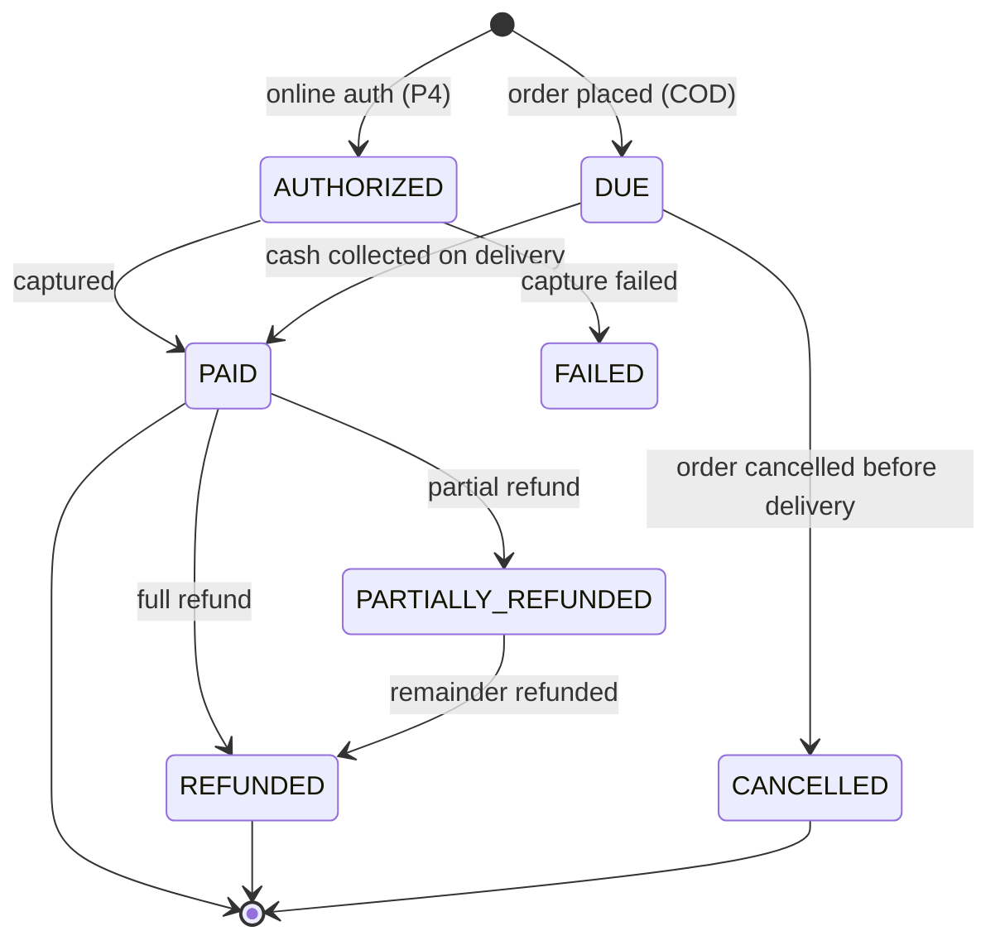

# 19 — Payment Architecture

No payment gateway is integrated at MVP. The system collects **Cash on Delivery**. This
document specifies the abstraction that makes Razorpay (or Stripe, or anything else) an
additive change rather than a rewrite.

## 1. The trap being avoided

The common mistake is `orders.is_paid BOOLEAN` plus a `cash_collected` flag. Adding a gateway
then requires new tables, a new state machine, changes to every order query, a migration of
historical data, and a rewrite of reconciliation. Refunds have nowhere to live. Partial
payments are unrepresentable.

Instead, **COD is modelled as a payment provider from day one.** It has a payment record, a
status lifecycle, an attempt, and a refund path. Razorpay is then a second implementation of
an interface that already has a working first implementation — the strongest possible proof
that the abstraction is real and not speculative (ADR-014).

## 2. Model

```
order ──1:1── payment ──1:N── payment_attempt
                 │
                 └──1:N── refund

payment_webhook_events   (inbound, verified, deduped)
```

| Entity | Purpose |
|---|---|
| `payments` | The money owed for an order and its settlement state. One per order. |
| `payment_attempts` | One interaction with a provider. COD has one; a card flow may have several. |
| `refunds` | Money returned, partially or fully. |
| `payment_webhook_events` | Raw verified provider callbacks, stored before processing. |

Schema in [04-DATABASE-DESIGN.md §10](04-DATABASE-DESIGN.md).

## 3. Payment status is not order status



An order can be `DELIVERED` with payment `PAID`, `DELIVERED` with payment `DUE` (cash not
collected — a reconciliation problem), or `DELIVERED` with payment `REFUNDED` (quality
complaint). Two independent facts, two independent fields. Collapsing them makes each of
these states unrepresentable (BR-O1).

## 4. The gateway interface

```ts
// packages/payments
export interface PaymentGateway {
  readonly provider: 'COD' | 'RAZORPAY' | 'STRIPE';
  readonly capabilities: {
    requiresClientAction: boolean;   // COD: false, Razorpay: true
    supportsRefund: boolean;
    supportsWebhook: boolean;
    supportsRecurring: boolean;      // for subscription auto-debit (P4)
  };

  initiate(input: InitiatePaymentInput): Promise<InitiatePaymentResult>;
  capture?(attemptId: string): Promise<CaptureResult>;
  refund(input: RefundInput): Promise<RefundResult>;
  verifyWebhook(rawBody: string, headers: Headers): WebhookVerification;
  parseWebhook(event: unknown): NormalisedPaymentEvent;
}
```

`capabilities` is what lets one checkout flow serve both providers: the client checks
`requiresClientAction` rather than checking `provider === 'COD'`. A `provider` string
comparison anywhere outside the gateway registry is a review rejection.

### COD adapter (MVP)
```
initiate() → { status: 'DUE', requiresClientAction: false }   // records the attempt only
capture()  → marks PAID, records collected_by_user_id          // called on DELIVERED
refund()   → records a manual refund for physical cash return
verifyWebhook() / parseWebhook() → not supported
```

Checkout therefore already runs through `PaymentGateway`. When Razorpay arrives, checkout
does not change — only the selected adapter does.

## 5. Flows

### 5.1 COD today
```
place order → payment (COD, DUE) → … → order DELIVERED
   → admin/rider marks collected → payment PAID, paid_at, collected_by_user_id
   → daily COD reconciliation report
```
Cancellation before delivery sets payment `CANCELLED`. No money moved, no refund needed.

### 5.2 Online, when enabled (P4)
```
POST /v1/me/orders { payment_method: 'ONLINE' }
  → order PENDING_PAYMENT (a new order_status value, added by ALTER TYPE)
  → payment AUTHORIZED-pending, attempt created
  → response carries provider_order_id + the client checkout payload
Client completes payment in the provider SDK
  → provider webhook → /v1/webhooks/razorpay
  → verify signature on the RAW body → store event → dedupe on event_id
  → capture → payment PAID → order PENDING → outbox PAYMENT_RECEIVED
Timeout (15 min, no payment)
  → order CANCELLED, slot capacity and stock released
```
Slot capacity and inventory **are** reserved during the payment window — otherwise a
customer pays for a slot that filled up while they were paying, which is the worse failure.
The 15-minute expiry job releases abandoned attempts.

### 5.3 Refunds (P2 for COD, P4 for online)
`orders:refund` + `payments:refund`. Amount validated against
`amount_paid_paise − amount_refunded_paise`. COD refunds record a manual cash return or a
credit note; online refunds call the provider and complete on webhook confirmation.

### 5.4 Subscription billing (P4)
COD today: each subscription delivery produces an order with its own COD payment. That
already works and needs no gateway.

Prepaid later: `subscription_billing_cycles` (period, amount, status, payment_id) plus a
gateway mandate token on the subscription. `PaymentGateway.supportsRecurring` gates it. The
subscription tables need **no structural change** — a billing cycle is a new child table,
and deliveries remain independent of payment.

## 6. Webhook security

Non-negotiable rules for every inbound provider callback:

1. **Verify the signature against the raw request body**, before any parsing. Parsing first
   and re-serialising breaks the signature and invites bypass. The API preserves the raw body
   on webhook routes specifically for this.
2. **Persist before processing.** Store the event in `payment_webhook_events` and return
   `200` promptly; process asynchronously.
3. **Dedupe on the provider's `event_id`** (unique index). Providers retry; retries must be
   free of side effects.
4. **Never trust the payload's amount.** Verify against our own `payments.amount_paise`
   before marking anything paid.
5. **Tolerate out-of-order events.** A `captured` arriving before an `authorized` must not
   regress the payment state; transitions are validated against the state machine.
6. **Never log the full payload.** Redact before storage and never log card, UPI or customer
   identifiers.

## 7. PCI and data handling

We are **SAQ-A**: card data never touches our servers. The provider's hosted checkout or SDK
collects it; we hold only tokens and identifiers.

Never stored, in any table or log: card numbers, CVV, expiry, UPI PIN, bank credentials,
provider secret keys (environment only).
Stored: `provider_payment_id`, `provider_order_id`, masked last-4 and network if the provider
returns them, amounts, status, timestamps.

`payment_attempts.raw_response` is redacted through an allow-list before storage — a
deny-list would eventually miss a new field.

## 8. Money handling

All amounts are `BIGINT` paise (doc 04 §1.2), which is also what Razorpay and Stripe expect,
so there is no conversion layer and no rounding at the boundary.

Invariants, enforced by `CHECK` constraints and service-layer assertions:
```
payments.amount_paise          = orders.total_paise
amount_paid_paise             <= amount_paise
amount_refunded_paise         <= amount_paid_paise
Σ completed refunds            = amount_refunded_paise
```

## 9. Reconciliation

**COD daily report** — orders `DELIVERED` today, cash expected, cash marked collected,
variance, and the per-staff breakdown. Any `DELIVERED` order with payment still `DUE` after
24h appears on the admin exception list.

**Online (P4)** — nightly comparison of our `PAID` payments against the provider's settlement
report, flagging any mismatch in either direction.

## 10. Adding Razorpay — the actual checklist

1. `packages/payments/src/adapters/razorpay.ts` implementing `PaymentGateway`.
2. Register it in the gateway registry; enable `ONLINE` in `settings`.
3. Add `PENDING_PAYMENT` to the `order_status` enum (`ALTER TYPE ... ADD VALUE`) and to the
   state machine table.
4. Implement `POST /v1/webhooks/razorpay` using the existing webhook-handling middleware.
5. Add the payment step to the checkout UI, driven by `capabilities.requiresClientAction`.
6. Add the expiry job for abandoned payment attempts.
7. Add reconciliation against settlement reports.
8. Test: success, failure, timeout, duplicate webhook, out-of-order webhook, partial refund.

**Not on the list:** changing the order state machine's existing transitions, changing the
subscription engine, migrating historical data, or touching `slot_capacity` or inventory
logic. That is the test of whether this abstraction was worth building — and it is why COD
is implemented as an adapter rather than as a special case.

## 11. Business rules

| ID | Rule |
|---|---|
| BR-P1 | Every order has exactly one `payments` row, including COD. |
| BR-P2 | Payment status and order status are independent. |
| BR-P3 | Business logic talks to `PaymentGateway`, never to a provider SDK. |
| BR-P4 | COD moves to `PAID` only on `DELIVERED`, recording the collector. |
| BR-P5 | Cancellation before delivery sets payment `CANCELLED`, not `REFUNDED`. |
| BR-P6 | Refunds never exceed the amount paid. |
| BR-P7 | Webhooks are signature-verified on the raw body, persisted, then deduped by provider event id. |
| BR-P8 | Card and credential data is never stored or logged. |
| BR-P9 | All amounts are integer paise. |
| BR-P10 | Slot capacity and inventory are held during an online payment window and released on expiry. |
| BR-P11 | No code outside the gateway registry branches on `provider`. |
